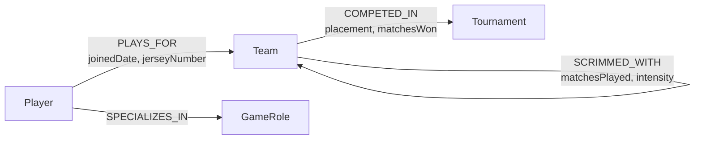

# Esports Tournament Network Explorer

> A full-stack graph database application that maps competitive esports ecosystems — players, teams, tournaments, and scrim networks — into an interactive, explorable knowledge graph.

Built as a take-home assessment for **Wexa AI**, this project demonstrates how graph databases solve relationship-heavy queries that would be painful or impossible to express cleanly in relational SQL.

---

## Live Demo & Walkthrough

| | Link |
|---|---|
| 🌐 **Hosted App** | [View on Vercel](#) *(placeholder — add your deployment URL)* |
| 🎥 **Video Walkthrough** | [Watch on Loom](#) *(placeholder — add your Loom/Drive link)* |

---

## Table of Contents

1. [Why a Graph Database?](#why-a-graph-database)
2. [Data Model](#data-model)
3. [Key Cypher Queries](#key-cypher-queries)
4. [Project Structure](#project-structure)
5. [Setup & Installation](#setup--installation)
6. [API Reference](#api-reference)
7. [Screenshots](#screenshots)
8. [Tech Stack](#tech-stack)

---

## Why a Graph Database?

### The Problem with Relational SQL for This Domain

Esports data is fundamentally a **network of relationships**. A player belongs to a team. That team competed in tournaments. Other teams competed in those same tournaments. Those rival teams also scrimmaged with yet more teams. Every interesting question requires traversing multiple hops across these connections.

In a relational database, each hop is a JOIN. Three hops means three JOINs — and the query planner must scan and hash-match potentially millions of rows at each step.

**Example: "Find all rival teams of a given player"**

In SQL this requires 5 tables and 4 JOINs:

```sql
SELECT DISTINCT t2.name AS rival_team, t2.region
FROM players p
JOIN team_memberships  tm  ON p.id          = tm.player_id
JOIN teams             t1  ON tm.team_id     = t1.id
JOIN tournament_entries te1 ON t1.id         = te1.team_id
JOIN tournament_entries te2 ON te1.tournament_id = te2.tournament_id
JOIN teams             t2  ON te2.team_id    = t2.id
WHERE p.name = 'Alex Rivera'
  AND t1.id != t2.id;
```

The database must:
1. Locate the player row (index scan)
2. Join to `team_memberships` (hash join, full scan of junction table)
3. Join to `teams` (index lookup)
4. Join to `tournament_entries` twice (two full scans of the junction table)
5. Join back to `teams` again (index lookup)
6. Deduplicate results

As the dataset grows, each junction table scan grows with it — **O(n²) complexity** at minimum.

**The same query in openCypher (graph):**

```cypher
MATCH (p:Player {name: $playerName})-[:PLAYS_FOR]->(t1:Team)
      -[:COMPETED_IN]->(tr:Tournament)<-[:COMPETED_IN]-(rival:Team)
WHERE t1 <> rival
RETURN rival.name, rival.region
```

One pattern. No joins. No junction tables.

---

### Index-Free Adjacency

The core architectural advantage of a graph database is **index-free adjacency**. In Neo4j/CognoDB, every node physically stores direct pointers to its neighboring nodes and relationships. Traversing a relationship is a **pointer dereference** — a constant-time O(1) operation — not a B-tree index lookup.

This means:

| Operation | SQL | Graph DB |
|---|---|---|
| Find a player's team | `JOIN team_memberships` | Follow `PLAYS_FOR` pointer |
| Find all tournaments a team entered | `JOIN tournament_entries` | Follow `COMPETED_IN` pointers |
| Find rival teams (3 hops) | 4 JOINs + dedup | 1 pattern match |
| Find 2nd-degree scrim partners | Self-join on self-join | 2-hop `SCRIMMED_WITH` traversal |
| Find 3rd-degree connections | Recursive CTE or application-level loop | Extend pattern by one clause |

The traversal cost in a graph database is **O(depth × average degree)** — it scales with the depth of the query, not the size of the dataset. A 3-hop query on 1 million nodes takes the same time as on 1,000 nodes, because the engine never scans the full dataset — it only follows the specific pointers relevant to the starting node.

---

### Why This Matters for Esports Data Specifically

**Scrim network analysis (2nd-degree connections):**

Finding teams that your scrim partners also scrim with — a "friend of a friend" query — requires a self-join on a self-join in SQL:

```sql
-- SQL: 2nd-degree scrim partners
SELECT DISTINCT s2.team_b AS second_degree_partner
FROM scrimmages s1
JOIN scrimmages s2 ON s1.team_b = s2.team_a
WHERE s1.team_a = 'Neon Wolves'
  AND s2.team_b != 'Neon Wolves'
  AND s2.team_b != s1.team_b;
```

In Cypher:

```cypher
MATCH (origin:Team {name: $teamName})-[:SCRIMMED_WITH]-(partner:Team)
      -[:SCRIMMED_WITH]-(partner2:Team)
WHERE partner2 <> origin
RETURN partner.name, partner2.name
```

**Tournament rivalry detection (3-hop traversal):**

The graph engine follows `Player → Team → Tournament ← Team` in a single pattern. There is no concept of a "join table" — the `COMPETED_IN` relationship is a first-class citizen stored directly on the node, not in a separate table that must be scanned.

**Dynamic path exploration:**

The interactive graph canvas in this app lets users visually explore these multi-hop paths. This kind of exploration is natural in a graph — you click a node and follow its edges. Replicating this in SQL would require recursive CTEs or application-level graph traversal logic built on top of flat query results.

---

## Data Model

### Mermaid Diagram



---

### ASCII Schema

```
  ┌──────────────────────────────────────────────────────────────────┐
  │                        GRAPH DATA MODEL                          │
  └──────────────────────────────────────────────────────────────────┘

  (:GameRole)
  ┌─────────────────┐
  │  id             │
  │  title          │◄──────────────────────────────────┐
  └─────────────────┘                                   │
                                                        │ [:SPECIALIZES_IN]
  (:Player)                                             │
  ┌─────────────────┐                                   │
  │  id             │───────────────────────────────────┘
  │  name           │
  │  handle         │──────────────────────────────────────────────────┐
  │  role           │                                                  │
  │  nationality    │                                                  │ [:PLAYS_FOR]
  │  winRate        │                                                  │ joinedDate
  └─────────────────┘                                                  │ jerseyNumber
                                                                       ▼
  (:Tournament)                                            (:Team)
  ┌─────────────────┐    [:COMPETED_IN]                ┌─────────────────┐
  │  id             │◄───────────────────────────────  │  id             │
  │  name           │    placement                     │  name           │
  │  tier           │    matchesWon                    │  tag            │
  │  prizePool      │                                  │  region         │
  │  year           │                                  │  establishedYear│
  └─────────────────┘                                  └────────┬────────┘
                                                                │
                                                                │ [:SCRIMMED_WITH]
                                                                │ matchesPlayed
                                                                │ intensity
                                                                └──────────────► (:Team)
```

---

### Node Properties

| Label | Property | Type | Description |
|---|---|---|---|
| `Player` | `id` | String | Unique identifier |
| | `name` | String | Full name |
| | `handle` | String | In-game alias |
| | `role` | String | Primary role |
| | `nationality` | String | Country code (ISO 2) |
| | `winRate` | Float | Career win rate (0.0–1.0) |
| `Team` | `id` | String | Unique identifier |
| | `name` | String | Team name |
| | `tag` | String | Short tag (e.g. `NW`) |
| | `region` | String | `NA`, `EU`, `APAC` |
| | `establishedYear` | Integer | Year founded |
| `Tournament` | `id` | String | Unique identifier |
| | `name` | String | Tournament name |
| | `tier` | String | `S+`, `S`, `A` |
| | `prizePool` | Integer | Prize pool in USD |
| | `year` | Integer | Year held |
| `GameRole` | `id` | String | Unique identifier |
| | `title` | String | Role name |

### Relationship Properties

| Type | Property | Type | Description |
|---|---|---|---|
| `PLAYS_FOR` | `joinedDate` | String | ISO date the player joined |
| | `jerseyNumber` | Integer | Player's jersey number |
| `COMPETED_IN` | `placement` | Integer | Final placement (1 = winner) |
| | `matchesWon` | Integer | Matches won in the tournament |
| `SCRIMMED_WITH` | `matchesPlayed` | Integer | Total scrim matches played |
| | `intensity` | String | `High`, `Medium`, `Low` |
| `SPECIALIZES_IN` | *(none)* | — | Simple role assignment |

---

## Key Cypher Queries

All queries use **named parameters** (`$paramName`) instead of string concatenation. This is non-negotiable for two reasons:

- **Security:** Prevents Cypher injection attacks — the same class of vulnerability as SQL injection.
- **Performance:** The query planner compiles and caches the query plan once. Subsequent calls with different parameter values reuse the cached plan rather than recompiling from scratch.

---

### 1. Multi-Hop Tournament Rival Detection

**What it does:** Starting from a player, traverse 3 relationship hops to find every team that competed in the same tournaments as the player's team.

```cypher
MATCH (p:Player {name: $playerName})-[:PLAYS_FOR]->(t1:Team)
      -[:COMPETED_IN]->(tr:Tournament)<-[:COMPETED_IN]-(rival:Team)
WHERE t1 <> rival
RETURN
  p.name       AS player,
  t1.name      AS playerTeam,
  tr.name      AS tournament,
  rival.name   AS rivalTeam,
  rival.region AS rivalRegion
ORDER BY tr.name
```

**Hop breakdown:**
```
(p:Player) ──PLAYS_FOR──► (t1:Team) ──COMPETED_IN──► (tr:Tournament) ◄──COMPETED_IN── (rival:Team)
    1                          2                            3                                4
```

The graph engine starts at the specific `Player` node (direct pointer lookup via the `name` property index), then follows outgoing `PLAYS_FOR` edges, then `COMPETED_IN` edges, then traverses **incoming** `COMPETED_IN` edges from other teams. No table scans. No joins. The `WHERE t1 <> rival` filter eliminates the team matching itself.

---

### 2. 2nd-Degree Scrim Synergy Network

**What it does:** Find a team's direct scrim partners, then find those partners' scrim partners — a social-network-style "friend of a friend" query.

```cypher
MATCH (origin:Team {name: $teamName})
OPTIONAL MATCH (origin)-[r1:SCRIMMED_WITH]-(partner:Team)
OPTIONAL MATCH (partner)-[r2:SCRIMMED_WITH]-(partner2:Team)
WHERE partner2 <> origin AND partner2 <> partner
RETURN
  origin.name                 AS origin,
  partner.name                AS directPartner,
  toInteger(r1.matchesPlayed) AS directMatches,
  r1.intensity                AS directIntensity,
  partner2.name               AS secondDegreePartner,
  toInteger(r2.matchesPlayed) AS secondDegreeMatches
ORDER BY directPartner, secondDegreePartner
```

`OPTIONAL MATCH` is used so teams with no scrim data still return a row (rather than being silently dropped). The undirected relationship pattern `(a)-[r]-(b)` matches `SCRIMMED_WITH` edges in either direction, since scrims are mutual.

---

### 3. Global Graph Fetch (Canvas Visualization)

**What it does:** Pull every node and every relationship in two queries, returning clean string IDs that the frontend can use to build the force-directed graph.

```cypher
-- Nodes
MATCH (n)
RETURN
  toString(elementId(n)) AS id,
  labels(n)              AS labels,
  properties(n)          AS props

-- Relationships
MATCH (a)-[r]->(b)
RETURN
  type(r)                AS type,
  toString(elementId(a)) AS source,
  toString(elementId(b)) AS target,
  properties(r)          AS props
```

`toString(elementId(n))` is critical here — CognoDB returns internal element IDs as 64-bit integers that exceed JavaScript's `Number.MAX_SAFE_INTEGER`. Coercing them to strings at the database level prevents silent precision loss in the JSON response.

---

## Project Structure

```
esports-graph-explorer/
├── backend/
│   ├── routes/
│   │   └── graph.js          # All API route handlers
│   ├── scripts/
│   │   └── seed.js           # Database reset + seed script
│   ├── db.js                 # Neo4j driver singleton + connection check
│   ├── server.js             # Express entry point
│   ├── .env                  # ⚠️  Never commit — add to .gitignore
│   └── package.json
│
├── frontend/
│   ├── src/
│   │   ├── components/
│   │   │   ├── GraphCanvas.jsx   # react-force-graph-2d wrapper
│   │   │   ├── GraphLegend.jsx   # Node type color legend
│   │   │   ├── SearchBar.jsx     # Debounced live search
│   │   │   ├── SidePanel.jsx     # Node detail + query results panel
│   │   │   └── Skeleton.jsx      # Loading skeleton components
│   │   ├── hooks/
│   │   │   └── useGraph.js       # Data fetching + formatting hook
│   │   ├── api.js                # Typed fetch wrapper
│   │   ├── App.jsx               # Root layout + error boundary
│   │   └── index.css             # Tailwind + custom esports theme
│   ├── vite.config.js            # Vite + Tailwind v4 + API proxy
│   └── package.json
│
└── README.md
```

---

## Setup & Installation

### Prerequisites

- **Node.js** v18 or higher
- **npm** v9 or higher
- A **CognoDB Cloud** account — or any Neo4j-compatible Bolt endpoint

---

### 1. Clone the Repository

```bash
git clone https://github.com/your-username/esports-graph-explorer.git
cd esports-graph-explorer
```

---

### 2. Configure Environment Variables

```bash
cd backend
cp .env.example .env   # or create .env manually
```

Open `backend/.env` and fill in your CognoDB credentials:

```env
COGNO_URI=bolt+s://your-instance.databases.cognodb.com:7687
COGNO_USER=your-username
COGNO_PASSWORD=your-password
PORT=4000
```

> ⚠️ **Never commit `.env` to version control.** It is already listed in `.gitignore`.

---

### 3. Install Backend Dependencies

```bash
# from the backend/ directory
npm install
```

---

### 4. Seed the Database

```bash
npm run seed
```

This script:
1. Wipes all existing nodes and relationships (`MATCH (n) DETACH DELETE n`)
2. Creates **5 GameRoles**, **6 Teams** (NA / EU / APAC), **3 Tournaments** (Tier S+, S, A)
3. Creates **15 Players** with realistic stats and nationalities
4. Creates all **PLAYS_FOR**, **SPECIALIZES_IN**, **COMPETED_IN**, and **SCRIMMED_WITH** relationships

Expected output:
```
🗑️  Clearing existing graph...
🎮 Creating GameRole nodes...
🏆 Creating Team nodes...
🥇 Creating Tournament nodes...
👤 Creating Player nodes...
🔗 Creating PLAYS_FOR relationships...
🎯 Creating SPECIALIZES_IN relationships...
🏅 Creating COMPETED_IN relationships...
⚔️  Creating SCRIMMED_WITH relationships...
✅ Seed complete! Graph is ready.
```

---

### 5. Start the Backend

```bash
npm run dev      # nodemon — auto-restarts on file changes
# or
npm start        # plain node
```

Server starts at `http://localhost:4000`. You should see:

```
🚀 Server running on http://localhost:4000
✅ Connected to CognoDB
```

---

### 6. Install & Start the Frontend

```bash
cd ../frontend
npm install
npm run dev
```

Open **`http://localhost:5173`** in your browser.

The Vite dev server proxies all `/api/*` requests to `http://localhost:4000`, so no CORS configuration is needed during development.

---

### 7. Production Build (Optional)

```bash
cd frontend
npm run build       # outputs to frontend/dist/
npm run preview     # preview the production build locally
```

---

## API Reference

All endpoints are prefixed with `/api/graph`.

| Method | Endpoint | Query Params | Description |
|---|---|---|---|
| `GET` | `/api/health` | — | Health check — returns `{ status: "ok" }` |
| `GET` | `/api/graph/all` | — | All nodes + relationships for the canvas |
| `GET` | `/api/graph/rivals` | `playerName` | Multi-hop rival team traversal |
| `GET` | `/api/graph/scrims` | `teamName` | 2-hop scrim synergy network |
| `GET` | `/api/graph/search` | `q` | Search players, teams, tournaments |
| `GET` | `/api/graph/player/:name` | — | Full player profile + tournament history |

**Example requests:**

```bash
# Health check
curl http://localhost:4000/api/health

# Get full graph
curl http://localhost:4000/api/graph/all

# Find rivals for a player
curl "http://localhost:4000/api/graph/rivals?playerName=Alex%20Rivera"

# Find scrim network for a team
curl "http://localhost:4000/api/graph/scrims?teamName=Neon%20Wolves"

# Search
curl "http://localhost:4000/api/graph/search?q=phantom"

# Player profile
curl "http://localhost:4000/api/graph/player/Alex%20Rivera"
```

---

## Screenshots

**Main Graph Canvas**


*Force-directed graph showing all players, teams, tournaments, and game roles with color-coded nodes.*

**Player Detail Panel**


*Side panel showing player stats, win rate bar, current team, and tournament history.*

**Rival Teams Analysis**


*Multi-hop rival detection — teams that competed in the same tournaments, grouped by event.*

**Scrim Network**


*2nd-degree scrim synergy — direct partners and their partners, with match intensity badges.*

**Search**


*Debounced live search across players, teams, and tournaments with type-labeled results.*

---

## Tech Stack

| Layer | Technology | Purpose |
|---|---|---|
| **Database** | CognoDB (Neo4j-compatible) | Graph storage, openCypher queries over Bolt protocol |
| **Backend** | Node.js + Express | REST API server |
| **DB Driver** | `neo4j-driver` v5 | Bolt protocol client |
| **Frontend** | React 19 + Vite 8 | UI framework + dev server |
| **Styling** | Tailwind CSS v4 | Utility-first styling |
| **Graph UI** | `react-force-graph-2d` | Force-directed canvas graph |
| **Icons** | `lucide-react` | Icon set |
| **Fonts** | Rajdhani + Inter (Google Fonts) | Esports display + body text |

---

## Environment Variables Reference

| Variable | Required | Description |
|---|---|---|
| `COGNO_URI` | ✅ | Bolt URI — e.g. `bolt+s://host:7687` |
| `COGNO_USER` | ✅ | Database username |
| `COGNO_PASSWORD` | ✅ | Database password |
| `PORT` | ❌ | Backend port (default: `4000`) |

---

## License

MIT — built for the Wexa AI take-home assessment.
